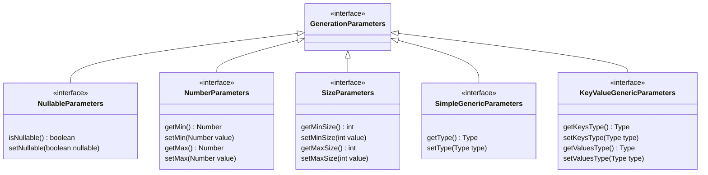
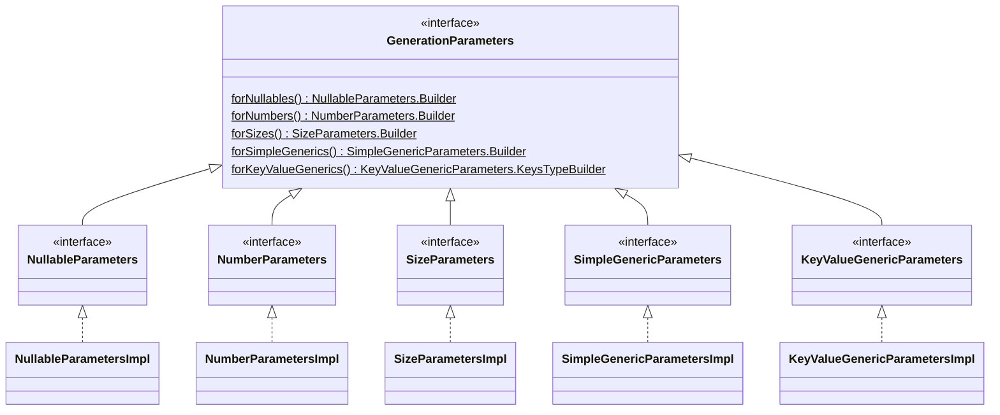
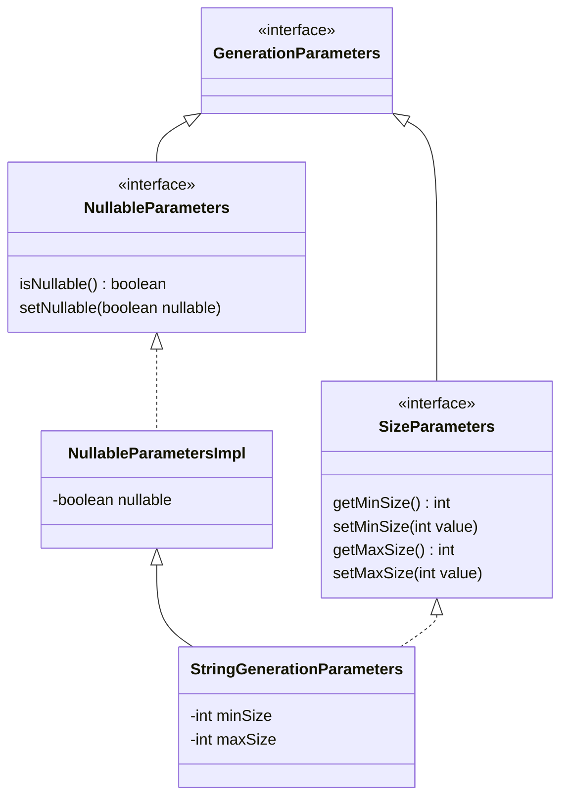
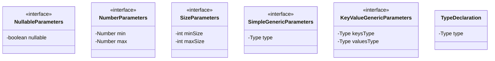
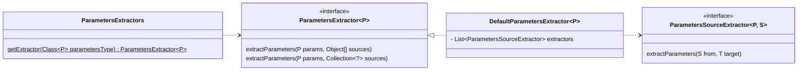

# Provide support for generation of additional types

## Generators implementation

For simple type generators use the `dev.orne.test.rnd.AbstractTypedGenerator`
class:

```java
public class MyGenerator
extends AbstractTypedGenerator<MyType> {

    @Override
    public @NotNull MyType defaultValue() {
        return new MyType();
    }

    @Override
    public @NotNull MyType randomValue() {
        final MyType instance = new MyType();
        // Generate random values for bean properties
        instance.setName(Generators.randomValue(String.class));
        return instance;
    }
}
```

If the generator must be used for more than one class or interface simply
override the `supports` method checking additional types:

```java
interface MyInterface {}
abstract class MyAbstractType {}
class MyType extends MyAbstractType implements MyInterface {}

public class MyGenerator
extends AbstractTypedGenerator<MyType> {

    /**
     * Generates MyInterface, MyAbstractType and MyType instances.
     */
    @Override
    public boolean supports(
            final @NotNull Class<?> type) {
        return super.supports(type)
                || MyAbstractType.class.equals(type)
                || MyInterface.class.equals(type);
    }

    @Override
    public @NotNull MyType defaultValue() {
        return new MyType();
    }

    @Override
    public @NotNull MyType randomValue() {
        final MyType instance = new MyType();
        // Generate random values for bean properties
        instance.setName(Generators.randomValue(String.class));
        return instance;
    }
}
```

### Generator priority

Registered generators are ordered based on their optional
`dev.orne.test.rnd.Priority` annotation. To override a registered generator
simply register a new generator implementation with a higher priority than the
existing generator.

```java
@Priority(Priority.DEFAULT)
public class MyImprovedGenerator ... {
    ...
}
```

All the built-in generators have a priority lower than the default priority, so
any registered generator without a priority annotation will have higher
priority than the built-in ones.

### Register new generators

To add support for new types simply implement the `dev.orne.test.rnd.Generator`
interface and register the new implementations through SPI in a
`META-INF/services/dev.orne.test.rnd.Generator` file:

```
org.example.MyNewGenerator
org.example.AnotherNewGenerator
```

### Parameterizable generators

The generators can accept parameters passed by the user or extracted
from the target (field, argument or return type).
The simplest way to implement a parameterizable generator is to extend the
`AbstractTypedParameterizableGenerator` abstract class:

```java
class MyParameters implements GenerationParameters {
    ...
}

public class MyGenerator
extends AbstractTypedParameterizableGenerator<MyType, MyParameters> {

    /**
     * {@inheritDoc}
     */
    @Override
    public @NotNull MyType defaultValue(
            @NotNull MyParameters parameters) {
        final MyType instance = new MyType();
        // Adjust default value to parameters if needed
        return instance;
    }

    /**
     * {@inheritDoc}
     */
    @Override
    public @NotNull MyType randomValue(
            @NotNull MyParameters parameters) {
        final MyType instance = new MyType();
        // Adjust random value to parameters
        return instance;
    }
}
```

The `AbstractParameterizableGenerator` and
`AbstractTypedParameterizableGenerator` already detect if the generation
parameters bean implements `NullableParameters` and honor it's `nullable`
property on calls to `nullableDefaultValue(...)` and
`nullableRandomValue(...)` methods.

See next section for generation parameters implementation details.

## Generation parameters

To implement parameterizable generators first choose or create a generation
parameters bean. Some interfaces are provided for common parameters:



Default implementations of each interface are provided and used in
`GenerationParameters` factory methods:



For example, `String` generator uses the `StringGenerationParameters` bean,
with the following class hierarchy:



### Generation parameter sources

Generation parameter sources can be of any type.
They can be passed to the `Generators` methods
with parameter sources argument or extracted from the targeted generation
targets (fields, parameters, return types).

In addition to aforementioned interfaces the class `TypeDeclaration`
is used to contain desired type declaration. This is specially useful for
generation of parameterized types (`ParameterizedType`) and generic array
types (`GenericArrayType`).



Targeted generators add Java Validation constraint annotations to generation
parameter sources passed to target type generators.

*Warning: Actually constraint annotations of static members are ignored.*

### Generation parameters extraction

When a generation request is received by a parameterizable generator it tries
to extract generation parameters from the received parameter sources.
This is performed by an interface based modular system which main API is
`ParametersExtractor`:



Implementations of `ParametersSourceExtractor` for the following source-parameters
are provided out-of-the-box:

```
javax.validation.constraints.NotNull -> NullableParameters
NullableParameters -> NullableParameters

javax.validation.constraints.Min -> NumberParameters
javax.validation.constraints.Max -> NumberParameters
javax.validation.constraints.Positive -> NumberParameters
javax.validation.constraints.PositiveOrZero -> NumberParameters
NumberParameters -> NumberParameters

javax.validation.constraints.Size -> SizeParameters
SizeParameters -> SizeParameters

TypeDeclaration -> SimpleGenericParameters
SimpleGenericParameters -> SimpleGenericParameters

TypeDeclaration -> KeyValueGenericParameters
KeyValueGenericParameters -> KeyValueGenericParameters
```

To extend the generation parameters extraction capabilities new
parameter source extractors can be provided by third party libraries.

For simple generation parameters extractors use the
`dev.orne.test.rnd.params.AbstractParametersSourceExtractor` class:

```java
public class MyExtractor
extends AbstractParametersSourceExtractor<MyParameters, MySource> {

    /**
     * {@inheritDoc}
     */
    @Override
    public void extractParameters(
            final @NotNull MySource from,
            final @NotNull MyParameters target) {
        // Populate parameters from source
    }
}
```

To add support for new parameter sources register the new
`dev.orne.test.rnd.params.ParametersSourceExtractor` interface implementations
SPI in a `META-INF/services/dev.orne.test.rnd.params.ParametersSourceExtractor`
file:

```
org.example.MyNewParametersSourceExtractor
org.example.AnotherNewParametersSourceExtractor
```
