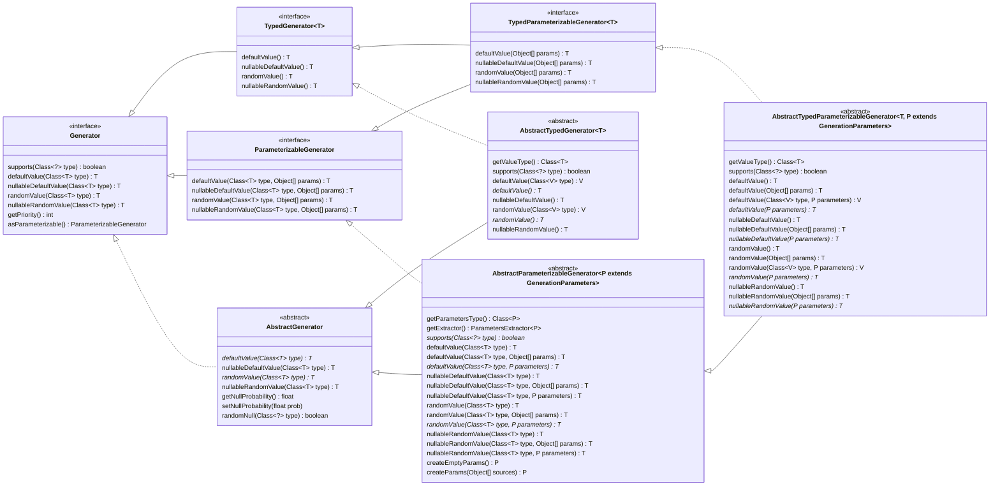

# Internal implementation technical details

## Generators

The generators system provide abstract implementations for generic
(based on received target class) and typed generation, both simple and
parameterizable:

